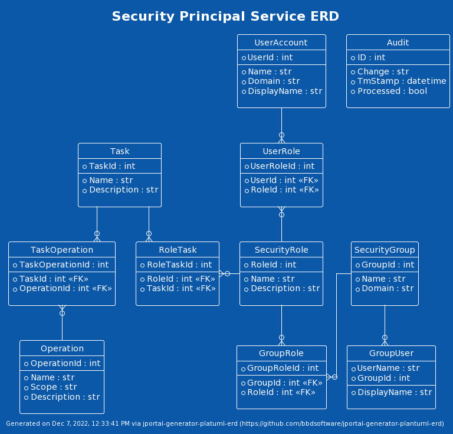

# jportal-generator-plantuml-erd
Generates an ERD from SI files, using PlantUML. For example:



# Using the generator
To use the generator, simply add the following to the jportal command-line
```sh
--template-generator ERD:/local/generated_sources/python/jportal --download-template "ERD:https://github.com/bbdsoftware/jportal-generator-plantuml-erd.git|1.0"
```

For example:
```sh
echo Running JPortal2 from ${PWD}...

docker run --rm -v ${PWD}:/local ghcr.io/si-gen/jportal2:latest \
                      --inputdir=/local/sql/si \
                      --template-generator "ERD:/local/generated_sources/python/jportal" \
                      --download-template "ERD:https://github.com/bbdsoftware/jportal-generator-plantuml-erd.git|1.0"
```
